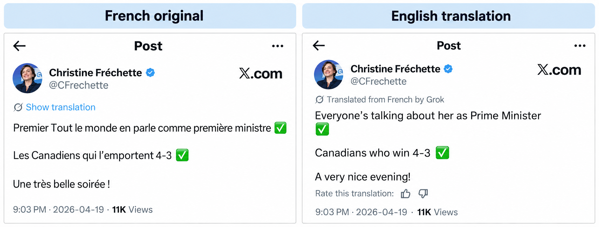

## Fluent, and still wrong

When I think about context in localization, the first example that comes to mind is an X post from April. Quebec's new Premier Christine Fréchette wrote about a very Montreal kind of evening. She had just made her first appearance as Premier on Radio-Canada's flagship talk show *Tout le monde en parle* (literally "everyone is talking about it"). Our Canadiens also won 4-3 that night. X's automatic translation by Grok turned her post into "Everyone's talking about her as Prime Minister" and "Canadians who win 4-3" ([Montreal Gazette](https://montrealgazette.com/news/quebecs-language-laws-face-a-new-reality-online-automatic-translation/)).

The English reads perfectly well. That is exactly the problem. Grok treated the name of a TV show as an ordinary phrase. It also picked the wrong office. In French, *première ministre* (literally "first minister") can mean a provincial premier or the federal prime minister. Canadian English uses a different word for each job. Grok lost the "first" meaning of *Premier* too, so the milestone of her first appearance disappeared. And it read the Canadiens as a nationality instead of a hockey team.

None of these are really grammar mistakes. They are failures to understand what the words refer to. A translator with the right local context would likely have avoided all of them, not because of better grammar but because the entities behind the words were clear.

## The context was already there

A model can only reason with the context it is given, and here the context was everywhere. A knowledge graph such as Wikidata can identify *Tout le monde en parle* as a TV program and the Canadiens as a hockey team. It also has an entry for the office of Premier of Quebec, with its name in both French and English. The author is a clue too: an account belonging to Quebec's Premier provides signals about the linguistic market, political context and likely local references.

A French Canadian to Canadian English glossary could catch known traps such as *première ministre* and *dépanneur* (a Quebec word for a convenience store). X also has a "Rate this translation" button, so corrections from readers could become reusable linguistic knowledge.

So the problem was not a lack of information. It was a failure to select the information that could change the translation decision.

## The research points the same way

Researchers have been measuring this exact problem. In 2025 the SemEval shared task on entity-aware machine translation compared 53 systems across 10 language pairs ([Conia et al., 2025](https://aclanthology.org/2025.semeval-1.326/)). Most of them were built on large language models. Systems that were given the correct entity up front reached 89.1 in entity accuracy, while the best system that had to find the entities on its own reached 77.1. Entity accuracy here is measured with M-ETA (manual entity translation accuracy). Finding the right entity turned out to be a big part of the problem. The organizers also found that COMET is not a good measure of entity translation. This common quality metric responds more to fluency than to whether the entity is right.

A 2026 study tested 11 language models in 10 languages ([Xu, Moroni and Navigli, LREC 2026](https://aclanthology.org/2026.lrec-1.692/)). External knowledge helped far more with culturally local entities than with global ones, with improvements of up to 70% in entity accuracy (M-ETA). A Quebec talk show and a Montreal hockey team are exactly that kind of local entity.

Fluency is not evidence that the model understood what the words refer to. That distinction is at the heart of context engineering.

## What I mean by context engineering

Context is a broad word. For localization I find it useful to think about it in layers such as:

<strong>Entity context:</strong> What is this thing? A TV show, a hockey team, a person, a product or a place.

<strong>Source context:</strong> Who is saying it, and for which market?

<strong>Product context:</strong> Where does the text appear, and what does the screen around it do?

<strong>Linguistic context:</strong> What terminology, grammar, register and locale rules apply?

The Grok post needed only 3 of these layers to get it right: entity, source and linguistic. Product context is the layer a social post does not have. It is also where software localization has the most experience.

That is what I mean by context engineering for localization. It is not about giving a model more information for its own sake. It is about finding the context that rules out the wrong interpretations, making it available in a form a model can use, and checking whether it actually led to the right decision.

## Context is not new to localization

Localization professionals have worked with context for a long time. Many software companies write their strings in a source language first and then localize them for each market. Developers are asked to add comments to strings that are ambiguous or constrained: a length limit on mobile, a call to action on a button, text a screen reader will read aloud, or a placeholder that pulls a destination name from a database.

Those comments work alongside the rest of the localization toolkit: translation memory of what was already approved, terminology that was researched and agreed on, and style guides that set the tone of voice. Together these assets make the output accurate, consistent and culturally relevant across a product. That is part of how localization earns trust.

So localization has never been free of context. But most of this context was written for a person to interpret, not for a model to use. What is changing is that AI can reason across many kinds of context at once, and it can even help produce that context.

## Apple is turning context into input for AI

Apple shows where this is heading. In Xcode 26 an on-device model analyzes the code and writes comments for localizable strings ([WWDC25](https://developer.apple.com/videos/play/wwdc2025/247/)). Apple frames these comments as a way to give translators what they need, such as which interface element a string belongs to and what its placeholders stand for.

In Xcode 27, agents can translate the strings in String Catalogs using the app's context and Apple's language style guides ([WWDC26](https://developer.apple.com/videos/play/wwdc2026/213/)). Developers can add their own guidance in a TRANSLATION.md file, including glossaries, terms to leave untranslated and tone rules.

What interests me is not that Apple added AI translation. It is that the app's context now becomes part of the translation input.

There is a catch. Generated context is not always good context. A developer may catch a comment that calls a label a button. But a developer may not know what a translator needs: grammatical gender, register, whether a placeholder is a city name, or whether a noun refers to a product feature or a person. A generated comment can sound plausible and still be linguistically insufficient.

This suggests a useful product principle: generating context and validating context are different jobs. Auto-generated context should be treated as a proposal and not as ground truth, both during translation and during source review if a team has one. Apple already hints at this. When comments are exported for translators, the generated ones are marked "auto-generated" so translators can tell them apart.

## From translating to generating

Rich context raises a bigger question. Do we still need to write everything in a single language first?

Take a familiar SEO practice. Marketers might A/B test 2 headlines such as "Popular hotels in [destination name]" and "Most searched hotels in [destination name]" on one point of sale, meaning the version of a site for a given market. Then they localize the winner into other languages. But the phrase that wins in English may not be the phrase people search for in French or German. What you optimize for may differ by market, not just the wording.

With enough context, an agent could write each language directly. It would need the intent, the component, the logic behind the content, the market and the place behind [destination name]. The copy would come from the meaning and constraints of the experience, rather than being translated from a sentence written for another market.

That last piece matters more than it looks, because place names carry grammar. In French the word for "in" changes with the place. You say *à Montréal* (in Montreal) and *au Canada* (in Canada), but *en France* (in France) and *aux États-Unis* (in the United States). Canada is masculine, France is feminine and the United States is plural, so each one needs a different form. A template that simply drops in a place name can get this wrong.

Traditionally, linguists work around this by restructuring the headline. They put the place name first and separate it with a colon, as in "[destination name]: popular hotels". The grammar is always safe, but the headline loses its fluency. This is where AI can make a difference. An agent that knows the entity and its grammar can write the actual sentence for each destination, and produce copy that works for both search and the language.

You can see a similar direction outside localization. [Abstract Wikipedia](https://abstract.wikipedia.org/wiki/Abstract_Wikipedia:Main_page) is experimenting with writing knowledge once in a form that does not belong to any language, then rendering it into different languages with structured data and language-specific functions. It is still early, but the idea is striking: separate the meaning from the language used to express it.

## Humans still own the context

None of this runs by itself. Automation can do much of the work, but closing the quality loop still needs people. Someone has to judge whether the context is sufficient, build the knowledge base with the right linguistic assets, and decide when something is truly ambiguous. Every correction can become reusable knowledge, but only if someone decides what the correction means and where it belongs.

This also changes how we should evaluate AI in localization. If fluent output can hide the wrong entity, then checking the output is not enough. We should also test the input. Did the model have enough context to make the decision? When several meanings were plausible, did it choose the right one, or flag the ambiguity for a person? Google researchers have started testing this for AI search. They built an automatic rater that judges whether the retrieved context is enough to answer a question ([Joren et al., ICLR 2025](https://arxiv.org/abs/2411.06037)). I have not seen the same kind of test for localization yet.

That leaves me with a question that has no simple organizational answer. Who owns the quality of the context?

Localization may own linguistic assets. Product may own product behavior. Engineering may own technical metadata. Design may own visual context. But someone has to own whether the available context is enough for a localization decision.

Maybe that is the next layer of localization: not just retrieving the right translation, but engineering the evidence we need to know what the translation should be.

### Sources

- [Montreal Gazette](https://montrealgazette.com/news/quebecs-language-laws-face-a-new-reality-online-automatic-translation/)
- [SemEval-2025 Task 2: Entity-Aware Machine Translation](https://aclanthology.org/2025.semeval-1.326/)
- [Cultural and Knowledge Biases in LLMs through the Lens of Entity-Aware Machine Translation (LREC 2026)](https://aclanthology.org/2026.lrec-1.692/)
- [What's new in Xcode 26 (WWDC25)](https://developer.apple.com/videos/play/wwdc2025/247/)
- [Translate your app using agents in Xcode (WWDC26)](https://developer.apple.com/videos/play/wwdc2026/213/)
- [Localizing your app using agents](https://developer.apple.com/documentation/Xcode/localizing-your-app-using-agents)
- [Abstract Wikipedia](https://abstract.wikipedia.org/wiki/Abstract_Wikipedia:Main_page)
- [Sufficient Context: A New Lens on Retrieval Augmented Generation Systems (ICLR 2025)](https://arxiv.org/abs/2411.06037)
