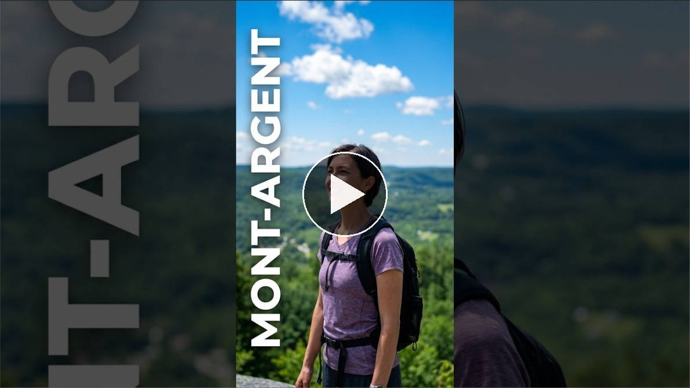
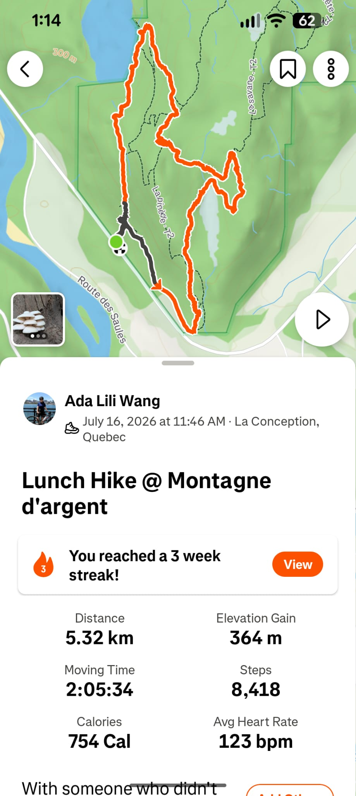

Here's a short video I made of the trip, click to check it out on YouTube.

I didn't expect to find ropes on a hiking trail this close to Montréal! But that's exactly what happened at Montagne d'Argent, in La Conception, Québec:

The hike was about 5.3 km with roughly 364 metres of elevation gain. It wasn't a long hike, but it definitely wasn't just a casual walk in the woods either 👀

There were rocks and forest🌲, little mushrooms along the trail🍄, wild blueberries 🫐, and eventually a small lake 💧(Lac d’Argent/Lake Argent) as a reward✨. It felt less like following a perfectly manicured trail and more like exploring a piece of the Laurentians.

That's probably what made the hike memorable for me.

Montagne d'Argent has around 15 km of hiking trails, with routes ranging from easier to more challenging terrain. The park itself describes some sections as including stairs, ladders, and handlines, and recommends appropriate equipment and experience for the more difficult trails. [The park's official site](https://www.montagnedargent.com/) also notes that the site is about 125 km from Montréal.

Would I do it again? Yes.

But I would probably pay a little more attention to the difficulty before bringing someone who isn't comfortable with rocky or steep terrain, especially careful about the rainy days. 

The ropes were part of the fun, but they also made it clear that this isn't the kind of hike where you can completely switch off and wander around in sneakers. For me, that's exactly what made it interesting.
