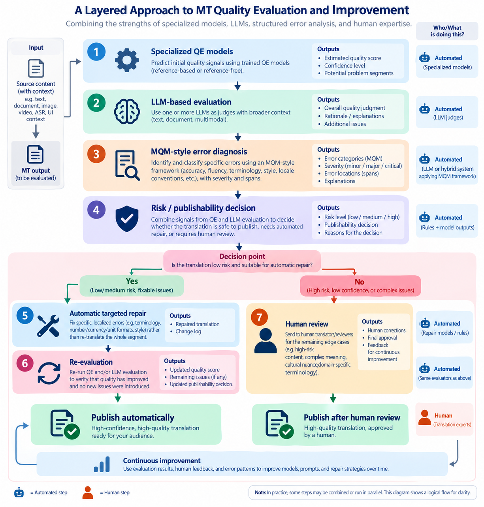

I've been spending more time looking at how machine translation (MT) quality is being evaluated as AI translation gets cheaper, faster, and fluent. One thing that keeps coming up is a shift in the question we are trying to answer.

For years, MT quality evaluation revolved around **“How good is this translation?”** That led to a familiar toolkit: BLEU, TER, COMET, MQM, human linguistic quality evaluation, and, more recently, LLM-based evaluation.

But it looks like things are shifting towards:

> **Can this translation be trusted for this particular use case? Can we make that decision automatically?**

That may sound like a small shift, but it changes what quality evaluation is for, how we measure it, and potentially how localization teams operate.

## From “What score did we get?” to “Can this ship?”

Traditional MT evaluation often produces a continuous quality score. That is useful for comparing systems, but it does not map neatly to a real localization workflow. A localization team does not necessarily need to know that one system scored 0.83 and another scored 0.86. What they really need to know is:

> **Which content can go straight to production, and which content needs human attention?**

This operational question is becoming much more explicit in MT research. WMT (Workshop on Machine Translation) 2026 introduced a dedicated **Detection of Error-Free Segments** task. Instead of asking systems only to predict a generic quality score, the task asks a binary question: is the segment error-free and therefore suitable for publication or consumption without further human intervention? The organizers explicitly connect the task to industrial MT pipelines, data filtering, and automated post-editing, and the task does not allow reference translations to be used. ([WMT 2026, Task 3](https://www2.statmt.org/wmt26/mteval-subtask3.html))

That feels like an important conceptual change:

**Quality Estimation (QE) is becoming less about ranking translations and more about making workflow decisions.**

## LLMs are entering the evaluator role, but “LLM-as-a-Judge” is not the end of the story

LLMs have made it much easier to evaluate translation for things that traditional metrics struggle with: meaning, fluency, terminology, style, and context. But simply asking one LLM to judge a translation raises an obvious question:

> **Why should we trust the judge?**

Recent research is starting to address that problem directly. A 2026 EMAT (European Association for Machine Translation) paper proposed an **“LLM-as-a-Jury”** framework that combines judgments from multiple LLMs instead of relying on a single evaluator. The study covered three domains and nine language pairs, and the authors found that the jury ensemble matched or outperformed the best individual juror in nearly every condition. They also compared different evaluation approaches, including edit-effort estimation, MQM-based linguistic quality assurance, and a purpose-built publishability prompt. ([Yanishevsky & Norris, EAMT 2026](https://aclanthology.org/2026.eamt-1.7/))

That points toward a more interesting architecture: **not one AI judge, but multiple quality signals working together.**

And that would be necessary as LLM evaluation itself is imperfect. Researchers continue to find problems with LLM-based judging, particularly when translations are non-literal or when the evaluator lacks enough context or reference information. So I don't think the future is “Replace COMET with GPT”. It is more likely to be:

> **Combine specialized QE models, LLM evaluators, structured error taxonomies, and human judgment.**

## MQM (Multidimensional Quality Metrics) may be becoming more useful, not less

Does MQM become obsoltele with the rise of LLM-based evaluation frameworks? I'm increasingly seeing the opposite.

MQM is useful because it provides a structured language for describing *why* a translation is wrong, e.g. terminology, accuracy, fluency, style, locale conventions, mistranslation, omissions, additions, and different levels of severity. That structure becomes particularly valuable **when the evaluator itself becomes less deterministic**.

A 2026 ACL (Association for Computational Linguistics) industry paper proposed a two-stage approach called **“Diagnose, Then Repair.”** Instead of asking an LLM to simply “judge and improve” a translation, the system first identifies specific error spans and assigns MQM-style diagnoses and severity. A separate model then performs constrained repairs based on those diagnoses. The researchers report better controllability and less unwanted paraphrasing than a one-stage judge-and-refine approach. ([Wang & Wu, ACL 2026](https://aclanthology.org/2026.acl-industry.115/)) This suggests an important design principle:

> **Evaluation and correction should not necessarily be the same task.**

An evaluator should explain the problem. A separate system can then decide whether and how to fix it. That feels much closer to how mature quality systems work in other industries.

## The next step: QE becomes an intervention loop

This is where things get particularly interesting. The traditional workflow looks something like:

**MT → quality evaluation → human review → final translation**

The emerging workflow could look more like:

**MT → detect risk → identify error → repair → re-evaluate → human review only when necessary**

In other words, quality evaluation is no longer necessarily the last step. It can become part of the generation loop itself.

The 2026 **“Diagnose, Then Repair”** research is one example of this direction. Other work is also exploring how fine-grained quality signals can be used directly in MT training and optimization. The result could be a **closed-loop translation quality system** rather than a simple scoring layer. The system does not simply say:

> “This translation is bad.”

It could instead identify a terminology error, assign its severity, propose a minimal correction, and then re-evaluate the revised output. That is far more actionable than a score on its own.

## Continuous quality scores still matter

This does not mean traditional QE metrics are disappearing. COMET and reference-free variants remain useful when you need a scalable numerical signal.

WMT 2026 is actually evaluating several complementary dimensions: **segment-level error detection and span annotation, segment-level quality score prediction, and detection of error-free segments.** ([WMT 2026, Automated Translation Quality Evaluation](https://www2.statmt.org/wmt26/mteval-task.html))

That structure itself is revealing. It recognizes that **“quality” is not one thing.** A useful system may need to answer several different questions:

- **Where is the error?**
- **How serious is it?**
- **How good is the segment overall?**
- **Can it ship without a human?**

These questions are related, but they are not interchangeable.

## “Quality” is becoming fit-for-purpose

One of the biggest problems with a single MT quality score is that the acceptable threshold depends on the use case.

Imagine four pieces of content: a customer-service FAQ, an internal HR article, a marketing campaign, and a regulatory document. It would be strange to demand exactly the same human-review process for all four.

The right question is therefore not simply:

> **“Is the translation good?”**

It is:

> **“Is the translation good enough for its intended purpose and risk level?”**

That suggests a future where quality thresholds become more contextual. For example, low-risk internal content might be eligible for automated approval; customer-facing content might receive automated QE plus selective human review; brand-sensitive marketing might require additional stylistic and terminology checks; and regulated content might still require much stricter human oversight.

The same translation engine could therefore produce different workflow outcomes depending on the content. This is one reason I think **publishability** is such an interesting concept: it turns quality from an abstract score into a business decision.

## Context matters as much as the evaluator

There is another shift happening underneath all of this. A translation can look perfect in isolation while being wrong in context.

A UI string might need to fit a particular button width. A product term might have an approved translation that is not the most obvious linguistic choice. A sentence may depend on information contained several paragraphs earlier. A marketing message may need to preserve a particular brand voice rather than simply convey literal meaning.

This means the future of QE is probably not just about building a smarter evaluator. It is also about giving the evaluator **better context**: terminology databases, translation memory, screenshots, product metadata, surrounding sentences, document-level context, brand guidelines, previous human decisions, and market-specific rules.

In other words:

> **Better evaluation may come as much from better context as from better models.**

WMT 2026 itself is moving toward more contextual evaluation: its shared-task test sets use longer multi-sentence segments, and the organizers note that multimodal context such as screenshots, video, and ASR (Automatic Speech Recognition) can be available to systems and human evaluators. ([WMT 2026, Task 1](https://www2.statmt.org/wmt26/mteval-subtask1.html))

## A bigger implication: MT quality affects AI quality

There is an even broader reason to care about this. Machine translation is more and more being used to create multilingual datasets and benchmarks for evaluating AI models, which creates a potentially serious problem: **translation errors can contaminate the evaluation of the AI itself.**

A 2026 ACL study examined this issue and found that target-side translation errors in multilingual benchmarks were consistently associated with measurable drops in translated accuracy, even after controlling for English correctness and source-side anomalies. The researchers also looked at how well automated systems could identify those translation errors. ([Thellmann et al., ACL 2026](https://aclanthology.org/2026.acl-long.1916/))

That means translation quality is no longer only a localization concern. It can affect **AI benchmarking, model evaluation, and our perception of multilingual AI performance.**

## So what does the future of MT evaluation look like?

A choice between traditional metrics and LLM judges won't be sufficient. A likely direction is a layered system in which different approaches perform different jobs:

*Figure 1. A proposed layered approach to MT quality evaluation and improvement. Automated evaluation and repair handle high-confidence cases, while human expertise remains in the loop for high-risk and ambiguous cases. Conceptual illustration by the author.*

In that world, the human linguist does not disappear. But the human's role changes. Instead of reviewing everything, they may increasingly review the cases that the system considers uncertain, risky, or consequential.

That is a very different operating model from traditional MT post-editing.

## The real opportunity may not be better MT

This leads me to a somewhat counterintuitive conclusion. The most valuable localization technology of the next few years may not be the system that produces the best translation. It may be the system that makes the **best decisions about translations**.

A slightly weaker model with excellent quality estimation, contextual awareness, and workflow routing could be more valuable to an enterprise than a theoretically superior translation model that cannot reliably tell when it is wrong.

The winning question may therefore become:

> **How much human attention can we safely eliminate without compromising the outcome?**

That is an operations question as much as an AI question. And it changes the role of MT quality evaluation from a measurement function into something much more strategic: 
**a decision layer between AI generation and human trust.**

That, to me, is one of the most interesting developments happening in localization right now.

## Sources & further reading

- [WMT 2026 — Automated Translation Quality Evaluation Systems](https://www2.statmt.org/wmt26/mteval-task.html)
- [WMT 2026 — Detection of Error-Free Segments](https://www2.statmt.org/wmt26/mteval-subtask3.html)
- [Yanishevsky & Norris — “LLM-as-a-Jury for Machine Translation Publishability Assessment,” EAMT 2026](https://aclanthology.org/2026.eamt-1.7/)
- [Wang & Wu — “Diagnose, Then Repair,” ACL 2026](https://aclanthology.org/2026.acl-industry.115/)
- [Thellmann et al. — “Quantifying the Impact of Translation Errors on Multilingual LLM Evaluation,” ACL 2026](https://aclanthology.org/2026.acl-long.1916/)

*This is my reading of the recent research and industry direction, not a claim that the field has reached a settled consensus.*
